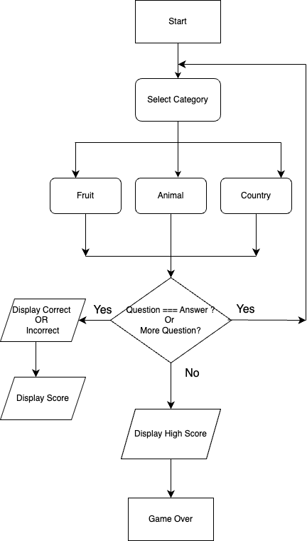

# Screenshot/Logo

# Game Name

Quiz Game 

# Quiz Game Link

https://waiwaiphyowp.github.io/Quiz-Game/

# How to Play the Quiz Game 

- Welcome to the **Photo Quiz Game**! 

**Start the Game**
- Click the ***Start Quiz*** button to begin the quiz. 

**Answer Qustions** 
- Once the game starts, you will see a photo along with multiple-choice answer the options.

- See a photo and click on the answer button you think is correct.
- You can select only one answer. 

- After selecting an answer, game will immediately display whether your answer is correct or incorrect. 

- After that, the next question will appear automatically. 

**Finish the Quiz**
- Once you've answered all the questions, you will see your final score with win or lose. 

**Good Luck and Have Fun!** 

# Flowchart 

# Key Learnings 

The key learnings revolve around efficiently managing DOM elements, using JavaScript for dynamic behavior like "updating scores, handling events and transitioning between questions" and providing a responsive and interactive user experience. 

# Attributions 

- Sounds: https://mixkit.co/ 
- Google Font 
- flowChart: Draw.io 
- CSS: Button Decoration using css gradient
https://cssgradient.io/gradient-backgrounds/
- JavaScript Help: 
 - www.freecodecamp.org
 - stackoverflow.com
 - www.w3schools.com
 - www.freecodecamp.org
 - developer.mozilla.org
 - medium.com
 - coderpad.io

# Technologies Used 
- HTML 
- CSS 
- JavaScript

# Future plans 

- No need to answer all the questions but display the finial score. 
- Restart Feature: Add the restart button to allow user to restart the game. 
- Timer: Add a countdown for each question 

